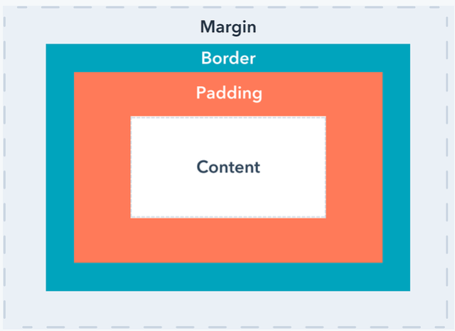

## difference between margin and padding?
---

핵심은, _Border안에 존재하는가(padding)_  
혹은 _Border밖에 존재하는가(Margin)_

 

## Margin
---
예를 들어, 10px를 가지는 margin은 아래와 같음  

위 element(margin=10px)를 4개를 배치하게 되면 서로 "push away"하는 형태가 됨  

#### when to use margin?
_To set distance between nearby elements_

 

## padding
---
padding은 border와 content 사이의 size  

#### when to use padding?
_Add space between content and its border_  

예를 들어, 클릭하기 쉽게 button의 사이즈를 키우고 싶은 경우 padding을 늘려주면 됨

 

## Reference
---

[margin vs padding](https://blog.hubspot.com/website/css-margin-vs-padding)