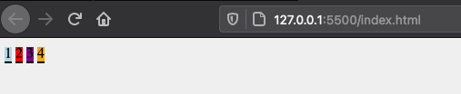
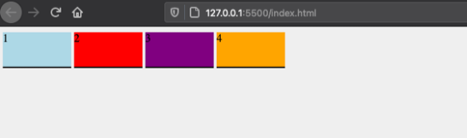

## display
---

#### `block`
- takes full width
- start on new line

div,p,ul등의 tag은 default로 `block` display값을 가짐

#### `inline`
- start on existing line
- ⚠️ __height,width 설정 불가__

block element에 display를 inline으로 설정  
> display: inline;



width,나 height를 주어도 변경이 없음!

```
.box {
  width: 100px;
  height: 50px;
  display: inline;
}
```

#### One Good Solution: `inline-block`
- start on existing line
- ⚠️ __height,width 설정 가능__

동일하게, box class에 inline설정 시, width와 height가 적용됨



<br>

## position
---
> The position property determines in what manner an item is positioned on the page or relative to one another.

default값은 `static`

## position types

#### `static`
- HTML document에 쓰여진 순서대로 dsiplay됨
- top,bottom,left,z-index 설정이 _적용되지 않음_

#### `relative`
- `static`과 거의 비슷함
- top,right,bottom,left, z-index 설정 가능
즉, `static` + property설정 가능

#### `absolute`
- element의 __바로 위 부모__ element기준, 상대 위치
- top,regit,bottom,left,z-index 설정 가능

#### `fixed`
- __browser 기준__, 상대 위치

#### `sticky`
- scrolling시, 고정된 위치(fixed)에 존재

## Reference
---

- [Understanding CSS Position & Display](https://medium.com/@mautayro/understanding-css-position-display-float-87f9727334b2)
- [Dream Coding](https://www.youtube.com/watch?v=jWh3IbgMUPI)